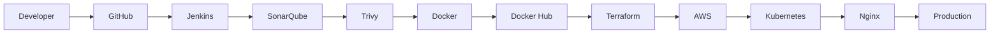
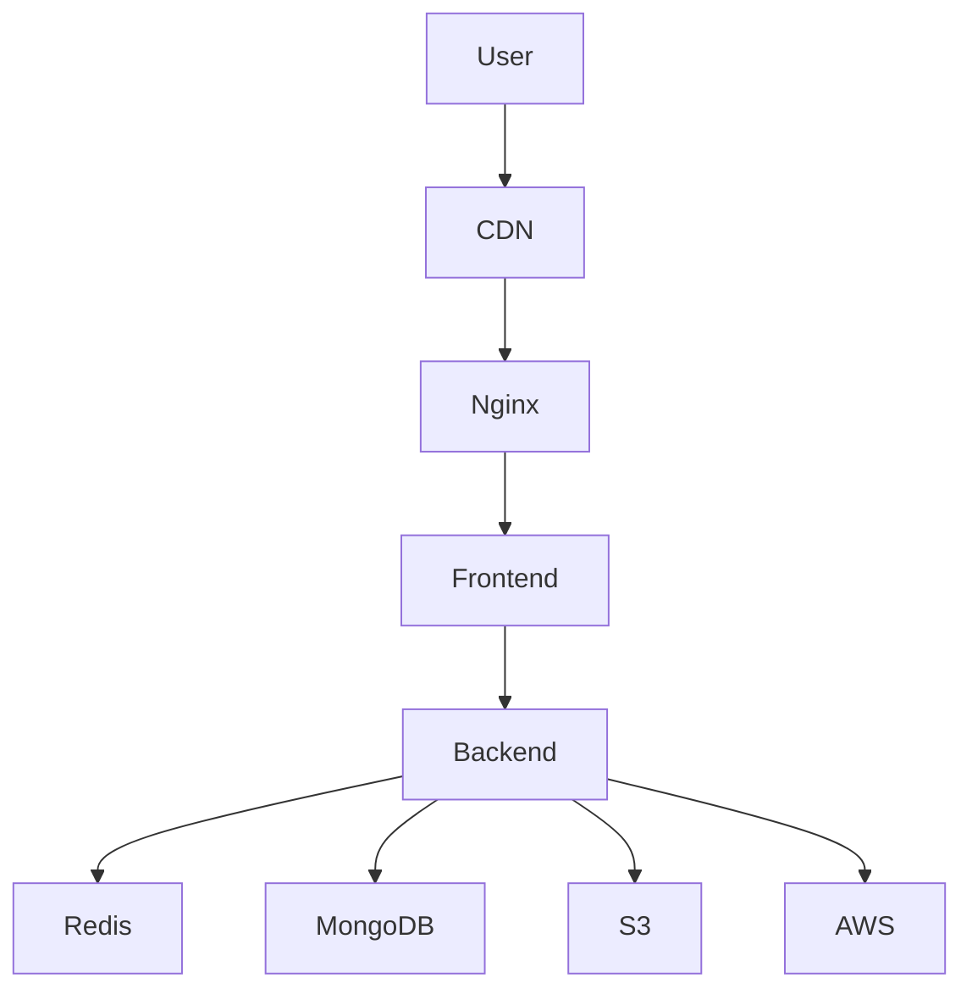

# 👋 Hi, I'm Suraj

<div align="center">


[](https://git.io/typing-svg)


</div>

---

# 🚀 About Me

- 🎓 B.Tech Final Year Student
- 💻 Backend Developer
- ⚙️ DevOps Enthusiast
- ☁️ AWS • Docker • Kubernetes • Terraform
- 🌱 Learning GitOps & Platform Engineering
- 🎯 Goal: Backend + DevOps Engineer

# 🛠️ Tech Stack

<p align="center">

</p>

# ☁️ DevOps Workflow



# 🏗️ Cloud Architecture



# 🚀 Featured Projects

## 📌 Planova
- Jira-like Project Management
- Next.js + Prisma + Clerk + PostgreSQL
- Kanban Board & Sprint Planning

## 🌍 Wanderlust
- MERN Travel Platform
- Authentication
- Booking & Reviews

## ☁️ DevOps Pipeline
- Jenkins
- Docker
- Terraform
- Kubernetes
- AWS
- SonarQube
- Trivy

# 📊 GitHub Stats

<p align="center">


</p>

<p align="center">

</p>

<p align="center">

</p>

<p align="center">

</p>

# 🎯 Learning Roadmap

| Technology | Status |
|------------|--------|
| Linux | ✅ |
| Git | ✅ |
| Docker | ✅ |
| Jenkins | ✅ |
| Terraform | ✅ |
| AWS | ✅ |
| Kubernetes | 🚀 |
| ArgoCD | 📖 |
| Prometheus | 📖 |
| Grafana | 📖 |


## 💡 DevOps Notes 1

### Principle
- Automate repetitive work.
- Everything should be version controlled.
- Infrastructure as Code.
- Monitor and observe applications.
- Secure pipelines by default.

### Commands
```bash
docker ps
kubectl get pods -A
terraform plan
terraform apply
aws sts get-caller-identity
```

### Best Practices
- Small commits
- CI before CD
- Immutable deployments
- Containerize applications
- Backup and rollback strategy

---

## 💡 DevOps Notes 2

### Principle
- Automate repetitive work.
- Everything should be version controlled.
- Infrastructure as Code.
- Monitor and observe applications.
- Secure pipelines by default.

### Commands
```bash
docker ps
kubectl get pods -A
terraform plan
terraform apply
aws sts get-caller-identity
```

### Best Practices
- Small commits
- CI before CD
- Immutable deployments
- Containerize applications
- Backup and rollback strategy

---

## 💡 DevOps Notes 3

### Principle
- Automate repetitive work.
- Everything should be version controlled.
- Infrastructure as Code.
- Monitor and observe applications.
- Secure pipelines by default.

### Commands
```bash
docker ps
kubectl get pods -A
terraform plan
terraform apply
aws sts get-caller-identity
```

### Best Practices
- Small commits
- CI before CD
- Immutable deployments
- Containerize applications
- Backup and rollback strategy

---

## 💡 DevOps Notes 4

### Principle
- Automate repetitive work.
- Everything should be version controlled.
- Infrastructure as Code.
- Monitor and observe applications.
- Secure pipelines by default.

### Commands
```bash
docker ps
kubectl get pods -A
terraform plan
terraform apply
aws sts get-caller-identity
```

### Best Practices
- Small commits
- CI before CD
- Immutable deployments
- Containerize applications
- Backup and rollback strategy

---

## 💡 DevOps Notes 5

### Principle
- Automate repetitive work.
- Everything should be version controlled.
- Infrastructure as Code.
- Monitor and observe applications.
- Secure pipelines by default.

### Commands
```bash
docker ps
kubectl get pods -A
terraform plan
terraform apply
aws sts get-caller-identity
```

### Best Practices
- Small commits
- CI before CD
- Immutable deployments
- Containerize applications
- Backup and rollback strategy

---

## 💡 DevOps Notes 6

### Principle
- Automate repetitive work.
- Everything should be version controlled.
- Infrastructure as Code.
- Monitor and observe applications.
- Secure pipelines by default.

### Commands
```bash
docker ps
kubectl get pods -A
terraform plan
terraform apply
aws sts get-caller-identity
```

### Best Practices
- Small commits
- CI before CD
- Immutable deployments
- Containerize applications
- Backup and rollback strategy

---

## 💡 DevOps Notes 7

### Principle
- Automate repetitive work.
- Everything should be version controlled.
- Infrastructure as Code.
- Monitor and observe applications.
- Secure pipelines by default.

### Commands
```bash
docker ps
kubectl get pods -A
terraform plan
terraform apply
aws sts get-caller-identity
```

### Best Practices
- Small commits
- CI before CD
- Immutable deployments
- Containerize applications
- Backup and rollback strategy

---

## 💡 DevOps Notes 8

### Principle
- Automate repetitive work.
- Everything should be version controlled.
- Infrastructure as Code.
- Monitor and observe applications.
- Secure pipelines by default.

### Commands
```bash
docker ps
kubectl get pods -A
terraform plan
terraform apply
aws sts get-caller-identity
```

### Best Practices
- Small commits
- CI before CD
- Immutable deployments
- Containerize applications
- Backup and rollback strategy

---

## 💡 DevOps Notes 9

### Principle
- Automate repetitive work.
- Everything should be version controlled.
- Infrastructure as Code.
- Monitor and observe applications.
- Secure pipelines by default.

### Commands
```bash
docker ps
kubectl get pods -A
terraform plan
terraform apply
aws sts get-caller-identity
```

### Best Practices
- Small commits
- CI before CD
- Immutable deployments
- Containerize applications
- Backup and rollback strategy

---

## 💡 DevOps Notes 10

### Principle
- Automate repetitive work.
- Everything should be version controlled.
- Infrastructure as Code.
- Monitor and observe applications.
- Secure pipelines by default.

### Commands
```bash
docker ps
kubectl get pods -A
terraform plan
terraform apply
aws sts get-caller-identity
```

### Best Practices
- Small commits
- CI before CD
- Immutable deployments
- Containerize applications
- Backup and rollback strategy

---

## 💡 DevOps Notes 11

### Principle
- Automate repetitive work.
- Everything should be version controlled.
- Infrastructure as Code.
- Monitor and observe applications.
- Secure pipelines by default.

### Commands
```bash
docker ps
kubectl get pods -A
terraform plan
terraform apply
aws sts get-caller-identity
```

### Best Practices
- Small commits
- CI before CD
- Immutable deployments
- Containerize applications
- Backup and rollback strategy

---

## 💡 DevOps Notes 12

### Principle
- Automate repetitive work.
- Everything should be version controlled.
- Infrastructure as Code.
- Monitor and observe applications.
- Secure pipelines by default.

### Commands
```bash
docker ps
kubectl get pods -A
terraform plan
terraform apply
aws sts get-caller-identity
```

### Best Practices
- Small commits
- CI before CD
- Immutable deployments
- Containerize applications
- Backup and rollback strategy

---

## 💡 DevOps Notes 13

### Principle
- Automate repetitive work.
- Everything should be version controlled.
- Infrastructure as Code.
- Monitor and observe applications.
- Secure pipelines by default.

### Commands
```bash
docker ps
kubectl get pods -A
terraform plan
terraform apply
aws sts get-caller-identity
```

### Best Practices
- Small commits
- CI before CD
- Immutable deployments
- Containerize applications
- Backup and rollback strategy

---

## 💡 DevOps Notes 14

### Principle
- Automate repetitive work.
- Everything should be version controlled.
- Infrastructure as Code.
- Monitor and observe applications.
- Secure pipelines by default.

### Commands
```bash
docker ps
kubectl get pods -A
terraform plan
terraform apply
aws sts get-caller-identity
```

### Best Practices
- Small commits
- CI before CD
- Immutable deployments
- Containerize applications
- Backup and rollback strategy

---

## 💡 DevOps Notes 15

### Principle
- Automate repetitive work.
- Everything should be version controlled.
- Infrastructure as Code.
- Monitor and observe applications.
- Secure pipelines by default.

### Commands
```bash
docker ps
kubectl get pods -A
terraform plan
terraform apply
aws sts get-caller-identity
```

### Best Practices
- Small commits
- CI before CD
- Immutable deployments
- Containerize applications
- Backup and rollback strategy

---

## 💡 DevOps Notes 16

### Principle
- Automate repetitive work.
- Everything should be version controlled.
- Infrastructure as Code.
- Monitor and observe applications.
- Secure pipelines by default.

### Commands
```bash
docker ps
kubectl get pods -A
terraform plan
terraform apply
aws sts get-caller-identity
```

### Best Practices
- Small commits
- CI before CD
- Immutable deployments
- Containerize applications
- Backup and rollback strategy

---

## 💡 DevOps Notes 17

### Principle
- Automate repetitive work.
- Everything should be version controlled.
- Infrastructure as Code.
- Monitor and observe applications.
- Secure pipelines by default.

### Commands
```bash
docker ps
kubectl get pods -A
terraform plan
terraform apply
aws sts get-caller-identity
```

### Best Practices
- Small commits
- CI before CD
- Immutable deployments
- Containerize applications
- Backup and rollback strategy

---

## 💡 DevOps Notes 18

### Principle
- Automate repetitive work.
- Everything should be version controlled.
- Infrastructure as Code.
- Monitor and observe applications.
- Secure pipelines by default.

### Commands
```bash
docker ps
kubectl get pods -A
terraform plan
terraform apply
aws sts get-caller-identity
```

### Best Practices
- Small commits
- CI before CD
- Immutable deployments
- Containerize applications
- Backup and rollback strategy

---

## 💡 DevOps Notes 19

### Principle
- Automate repetitive work.
- Everything should be version controlled.
- Infrastructure as Code.
- Monitor and observe applications.
- Secure pipelines by default.

### Commands
```bash
docker ps
kubectl get pods -A
terraform plan
terraform apply
aws sts get-caller-identity
```

### Best Practices
- Small commits
- CI before CD
- Immutable deployments
- Containerize applications
- Backup and rollback strategy

---

## 💡 DevOps Notes 20

### Principle
- Automate repetitive work.
- Everything should be version controlled.
- Infrastructure as Code.
- Monitor and observe applications.
- Secure pipelines by default.

### Commands
```bash
docker ps
kubectl get pods -A
terraform plan
terraform apply
aws sts get-caller-identity
```

### Best Practices
- Small commits
- CI before CD
- Immutable deployments
- Containerize applications
- Backup and rollback strategy

---

## 💡 DevOps Notes 21

### Principle
- Automate repetitive work.
- Everything should be version controlled.
- Infrastructure as Code.
- Monitor and observe applications.
- Secure pipelines by default.

### Commands
```bash
docker ps
kubectl get pods -A
terraform plan
terraform apply
aws sts get-caller-identity
```

### Best Practices
- Small commits
- CI before CD
- Immutable deployments
- Containerize applications
- Backup and rollback strategy

---

## 💡 DevOps Notes 22

### Principle
- Automate repetitive work.
- Everything should be version controlled.
- Infrastructure as Code.
- Monitor and observe applications.
- Secure pipelines by default.

### Commands
```bash
docker ps
kubectl get pods -A
terraform plan
terraform apply
aws sts get-caller-identity
```

### Best Practices
- Small commits
- CI before CD
- Immutable deployments
- Containerize applications
- Backup and rollback strategy

---

## 💡 DevOps Notes 23

### Principle
- Automate repetitive work.
- Everything should be version controlled.
- Infrastructure as Code.
- Monitor and observe applications.
- Secure pipelines by default.

### Commands
```bash
docker ps
kubectl get pods -A
terraform plan
terraform apply
aws sts get-caller-identity
```

### Best Practices
- Small commits
- CI before CD
- Immutable deployments
- Containerize applications
- Backup and rollback strategy

---

## 💡 DevOps Notes 24

### Principle
- Automate repetitive work.
- Everything should be version controlled.
- Infrastructure as Code.
- Monitor and observe applications.
- Secure pipelines by default.

### Commands
```bash
docker ps
kubectl get pods -A
terraform plan
terraform apply
aws sts get-caller-identity
```

### Best Practices
- Small commits
- CI before CD
- Immutable deployments
- Containerize applications
- Backup and rollback strategy

---

## 💡 DevOps Notes 25

### Principle
- Automate repetitive work.
- Everything should be version controlled.
- Infrastructure as Code.
- Monitor and observe applications.
- Secure pipelines by default.

### Commands
```bash
docker ps
kubectl get pods -A
terraform plan
terraform apply
aws sts get-caller-identity
```

### Best Practices
- Small commits
- CI before CD
- Immutable deployments
- Containerize applications
- Backup and rollback strategy

---

## 💡 DevOps Notes 26

### Principle
- Automate repetitive work.
- Everything should be version controlled.
- Infrastructure as Code.
- Monitor and observe applications.
- Secure pipelines by default.

### Commands
```bash
docker ps
kubectl get pods -A
terraform plan
terraform apply
aws sts get-caller-identity
```

### Best Practices
- Small commits
- CI before CD
- Immutable deployments
- Containerize applications
- Backup and rollback strategy

---

## 💡 DevOps Notes 27

### Principle
- Automate repetitive work.
- Everything should be version controlled.
- Infrastructure as Code.
- Monitor and observe applications.
- Secure pipelines by default.

### Commands
```bash
docker ps
kubectl get pods -A
terraform plan
terraform apply
aws sts get-caller-identity
```

### Best Practices
- Small commits
- CI before CD
- Immutable deployments
- Containerize applications
- Backup and rollback strategy

---

## 💡 DevOps Notes 28

### Principle
- Automate repetitive work.
- Everything should be version controlled.
- Infrastructure as Code.
- Monitor and observe applications.
- Secure pipelines by default.

### Commands
```bash
docker ps
kubectl get pods -A
terraform plan
terraform apply
aws sts get-caller-identity
```

### Best Practices
- Small commits
- CI before CD
- Immutable deployments
- Containerize applications
- Backup and rollback strategy

---

## 💡 DevOps Notes 29

### Principle
- Automate repetitive work.
- Everything should be version controlled.
- Infrastructure as Code.
- Monitor and observe applications.
- Secure pipelines by default.

### Commands
```bash
docker ps
kubectl get pods -A
terraform plan
terraform apply
aws sts get-caller-identity
```

### Best Practices
- Small commits
- CI before CD
- Immutable deployments
- Containerize applications
- Backup and rollback strategy

---

## 💡 DevOps Notes 30

### Principle
- Automate repetitive work.
- Everything should be version controlled.
- Infrastructure as Code.
- Monitor and observe applications.
- Secure pipelines by default.

### Commands
```bash
docker ps
kubectl get pods -A
terraform plan
terraform apply
aws sts get-caller-identity
```

### Best Practices
- Small commits
- CI before CD
- Immutable deployments
- Containerize applications
- Backup and rollback strategy

---

## 💡 DevOps Notes 31

### Principle
- Automate repetitive work.
- Everything should be version controlled.
- Infrastructure as Code.
- Monitor and observe applications.
- Secure pipelines by default.

### Commands
```bash
docker ps
kubectl get pods -A
terraform plan
terraform apply
aws sts get-caller-identity
```

### Best Practices
- Small commits
- CI before CD
- Immutable deployments
- Containerize applications
- Backup and rollback strategy

---

## 💡 DevOps Notes 32

### Principle
- Automate repetitive work.
- Everything should be version controlled.
- Infrastructure as Code.
- Monitor and observe applications.
- Secure pipelines by default.

### Commands
```bash
docker ps
kubectl get pods -A
terraform plan
terraform apply
aws sts get-caller-identity
```

### Best Practices
- Small commits
- CI before CD
- Immutable deployments
- Containerize applications
- Backup and rollback strategy

---

## 💡 DevOps Notes 33

### Principle
- Automate repetitive work.
- Everything should be version controlled.
- Infrastructure as Code.
- Monitor and observe applications.
- Secure pipelines by default.

### Commands
```bash
docker ps
kubectl get pods -A
terraform plan
terraform apply
aws sts get-caller-identity
```

### Best Practices
- Small commits
- CI before CD
- Immutable deployments
- Containerize applications
- Backup and rollback strategy

---

## 💡 DevOps Notes 34

### Principle
- Automate repetitive work.
- Everything should be version controlled.
- Infrastructure as Code.
- Monitor and observe applications.
- Secure pipelines by default.

### Commands
```bash
docker ps
kubectl get pods -A
terraform plan
terraform apply
aws sts get-caller-identity
```

### Best Practices
- Small commits
- CI before CD
- Immutable deployments
- Containerize applications
- Backup and rollback strategy

---

## 💡 DevOps Notes 35

### Principle
- Automate repetitive work.
- Everything should be version controlled.
- Infrastructure as Code.
- Monitor and observe applications.
- Secure pipelines by default.

### Commands
```bash
docker ps
kubectl get pods -A
terraform plan
terraform apply
aws sts get-caller-identity
```

### Best Practices
- Small commits
- CI before CD
- Immutable deployments
- Containerize applications
- Backup and rollback strategy

---

## 💡 DevOps Notes 36

### Principle
- Automate repetitive work.
- Everything should be version controlled.
- Infrastructure as Code.
- Monitor and observe applications.
- Secure pipelines by default.

### Commands
```bash
docker ps
kubectl get pods -A
terraform plan
terraform apply
aws sts get-caller-identity
```

### Best Practices
- Small commits
- CI before CD
- Immutable deployments
- Containerize applications
- Backup and rollback strategy

---

## 💡 DevOps Notes 37

### Principle
- Automate repetitive work.
- Everything should be version controlled.
- Infrastructure as Code.
- Monitor and observe applications.
- Secure pipelines by default.

### Commands
```bash
docker ps
kubectl get pods -A
terraform plan
terraform apply
aws sts get-caller-identity
```

### Best Practices
- Small commits
- CI before CD
- Immutable deployments
- Containerize applications
- Backup and rollback strategy

---

## 💡 DevOps Notes 38

### Principle
- Automate repetitive work.
- Everything should be version controlled.
- Infrastructure as Code.
- Monitor and observe applications.
- Secure pipelines by default.

### Commands
```bash
docker ps
kubectl get pods -A
terraform plan
terraform apply
aws sts get-caller-identity
```

### Best Practices
- Small commits
- CI before CD
- Immutable deployments
- Containerize applications
- Backup and rollback strategy

---

## 💡 DevOps Notes 39

### Principle
- Automate repetitive work.
- Everything should be version controlled.
- Infrastructure as Code.
- Monitor and observe applications.
- Secure pipelines by default.

### Commands
```bash
docker ps
kubectl get pods -A
terraform plan
terraform apply
aws sts get-caller-identity
```

### Best Practices
- Small commits
- CI before CD
- Immutable deployments
- Containerize applications
- Backup and rollback strategy

---

## 💡 DevOps Notes 40

### Principle
- Automate repetitive work.
- Everything should be version controlled.
- Infrastructure as Code.
- Monitor and observe applications.
- Secure pipelines by default.

### Commands
```bash
docker ps
kubectl get pods -A
terraform plan
terraform apply
aws sts get-caller-identity
```

### Best Practices
- Small commits
- CI before CD
- Immutable deployments
- Containerize applications
- Backup and rollback strategy

---

# 📫 Connect

- GitHub: https://github.com/iamsnyg
- LinkedIn: https://linkedin.com/in/YOUR_LINKEDIN
- Portfolio: https://your-portfolio.com
- Email: your@email.com

# 🐍 Contribution Snake

Create a GitHub Actions workflow using Platane/snk to generate the snake SVG automatically.

<div align="center">

</div>
