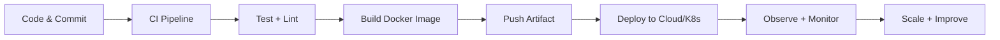

#  Hey, I'm Sunny Gupta

<p align="center">
  
</p>

<p align="center">
  <a href="https://github.com/iamsnyg"></a>
  <a href="https://github.com/iamsnyg?tab=repositories"></a>
  <a href="https://your-portfolio-link.com"></a>
  <a href="mailto:your-email@example.com"></a>
</p>

---

## 🧑‍🚀 About Me

```yaml
name: Sunny Gupta
title: Full Stack Developer | DevOps Enthusiast
focus:
  - Scalable Web Apps
  - Cloud & DevOps
  - CI/CD Automation
currently_learning:
  - Kubernetes in Production
  - Terraform & IaC
  - Advanced System Design
```

---

## 🧰 Tech Arsenal

### 👨‍💻 Languages


### 🎨 Frontend


### ⚙️ Backend & Database


### ☁️ DevOps & Cloud


---

## ⚡ DevOps Workflow



---

## 🌟 Featured Projects

### 🔹 Project One
Short description with impact and your role.  
🔗 [Live Demo](https://example.com) • 📁 [Repository](https://github.com/iamsnyg/project-one)

### 🔹 Project Two
Short description with impact and your role.  
🔗 [Live Demo](https://example.com) • 📁 [Repository](https://github.com/iamsnyg/project-two)

### 🔹 Project Three
Short description with impact and your role.  
🔗 [Live Demo](https://example.com) • 📁 [Repository](https://github.com/iamsnyg/project-three)

---

## 📊 GitHub Analytics

<p align="center">
  
  
</p>

<p align="center">
  
</p>

---

## 🌍 Connect With Me

<p align="center">
  <a href="https://linkedin.com/in/your-linkedin"></a>
  <a href="mailto:your-email@example.com"></a>
  <a href="https://your-portfolio-link.com"></a>
</p>

<p align="center">
  
</p>

---

<p align="center">
  <b>💙 Thanks for visiting my profile!</b><br/>
  <i>Build • Automate • Deploy • Scale</i>
</p>
