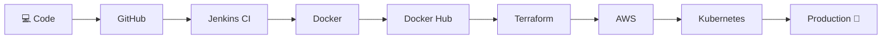
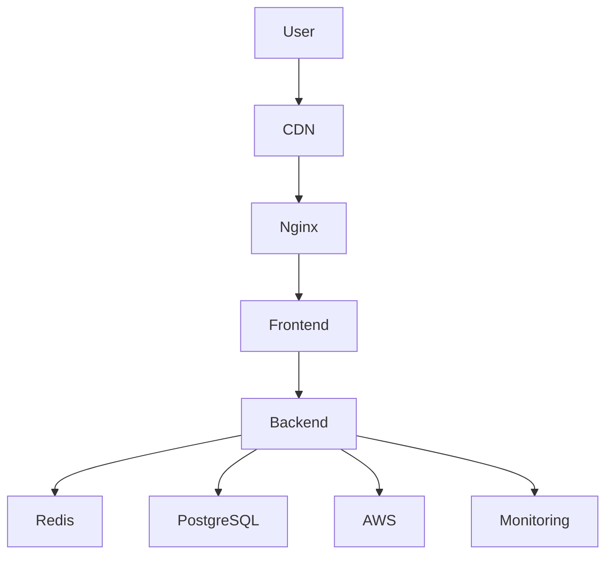

````markdown
<div align="center">


# 👋 Hi, I'm Suraj

### Backend Developer • DevOps Engineer • Cloud Enthusiast


<p>


</p>

</div>

---


# 💫 About Me

<table>
<tr>

<td width="60%">

🚀 Backend Developer passionate about scalable applications.

☁️ DevOps enthusiast focused on automation & cloud.

🐳 Building production-ready applications using Docker, Kubernetes & AWS.

⚡ Love solving real-world engineering challenges.

🎯 Goal: Become a Cloud & Platform Engineer.

</td>

<td>


</td>

</tr>
</table>

---

# 🛠 Tech Stack

<div align="center">


</div>

---

# ⚙️ DevOps Workflow



---

# ☁️ Cloud Architecture



---

# 🚀 Featured Projects

<div align="center">

| 🚀 Project | Description | Stack |
|:---------:|-------------|-------|
| 📌 **Planova** | Jira-inspired project management platform with Kanban board and sprint planning | Next.js • Prisma • Clerk |
| ☁️ **DevOps Pipeline** | Complete CI/CD pipeline with Infrastructure as Code | Jenkins • Docker • Terraform • Kubernetes |
| 🌍 **Wanderlust** | Full Stack Travel Booking Platform | MERN Stack |
| 🤖 **Career AI** | AI-powered Resume & Interview Platform | Next.js • AI • PostgreSQL |

</div>

---

# 📊 GitHub Analytics

<div align="center">


<br><br>


</div>

---

# 🌐 Connect With Me

<div align="center">

<a href="https://github.com/iamsnyg">

</a>

<a href="https://linkedin.com/in/YOUR-LINKEDIN">

</a>

<a href="mailto:YOUR-EMAIL">

</a>

<a href="https://your-portfolio.com">

</a>

</div>

---

<div align="center">

## ⭐ "Build • Automate • Deploy • Scale"


</div>
````
